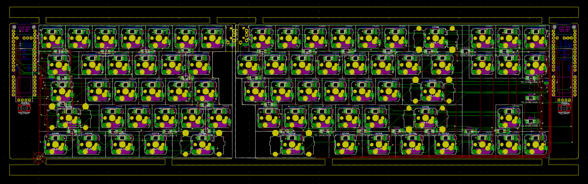

# bakekujira

## features
* TKL, F-row less
* split 
* per-key rgb
* backlit
* Proton-C supported
* support for 128x32 or 256x32 (256x32 wip)
* QMK

## Inspiration
* Corne
* corne waffle

## Notes
* Sorry for not using Kanji, thought Kana had a better overall fit!

## Credits
* Drashna
* foostan
